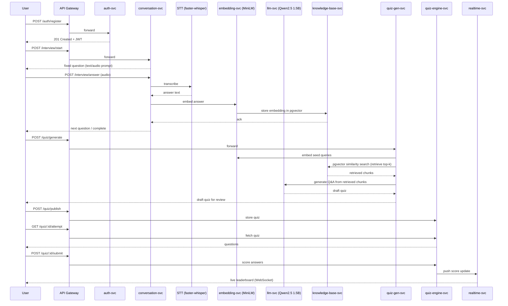

# API Pathways

```mermaid
sequenceDiagram
  participant U as User
  participant GW as API Gateway
  participant A as auth-svc
  participant C as conversation-svc
  participant ST as STT (faster-whisper)
  participant EM as embedding-svc (MiniLM)
  participant L as llm-svc (Qwen2.5 1.5B)
  participant K as knowledge-base-svc
  participant Q as quiz-gen-svc
  participant E as quiz-engine-svc
  participant R as realtime-svc
  
  U->>GW: POST /auth/register
  GW->>A: forward
  A-->>U: 201 Created + JWT
  
  U->>GW: POST /interview/start
  GW->>C: forward
  C-->>U: fixed question (text/audio prompt)
  U->>C: POST /interview/answer (audio)
  C->>ST: transcribe
  ST-->>C: answer text
  C->>EM: embed answer
  EM->>K: store embedding in pgvector
  K-->>C: ack
  C-->>U: next question / complete
  
  U->>GW: POST /quiz/generate
  GW->>Q: forward
  Q->>EM: embed seed queries
  Q->>K: pgvector similarity search (retrieve top-k)
  K-->>Q: retrieved chunks
  Q->>L: generate Q&A from retrieved chunks
  L-->>Q: draft quiz
  Q-->>U: draft quiz for review
  
  U->>GW: POST /quiz/publish
  GW->>E: store quiz
  
  U->>GW: GET /quiz/:id/attempt
  GW->>E: fetch quiz
  E-->>U: questions
  
  U->>GW: POST /quiz/:id/submit
  GW->>E: score answers
  E->>R: push score update
  R-->>U: live leaderboard (WebSocket)
```
