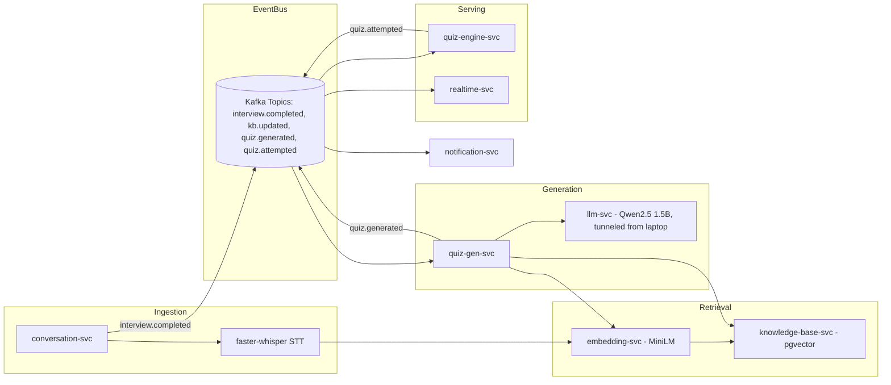

# HLD Event Flow

```mermaid
graph LR
  subgraph Ingestion
    Conv[conversation-svc]
    STT[faster-whisper STT]
  end
  subgraph Retrieval
    EM[embedding-svc - MiniLM]
    KB[knowledge-base-svc - pgvector]
  end
  subgraph Generation
    QGen[quiz-gen-svc]
    LLM[llm-svc - Qwen2.5 1.5B, tunneled from laptop]
  end
  subgraph Serving
    QEng[quiz-engine-svc]
    RT[realtime-svc]
  end
  subgraph EventBus
    Kafka[(Kafka Topics: interview.completed, kb.updated, quiz.generated, quiz.attempted)]
  end
  Conv --> STT
  STT --> EM
  EM --> KB
  Conv -->|interview.completed| Kafka
  Kafka --> QGen
  QGen --> EM
  QGen --> KB
  QGen --> LLM
  QGen -->|quiz.generated| Kafka
  Kafka --> QEng
  QEng -->|quiz.attempted| Kafka
  Kafka --> RT
  Kafka --> Notif[notification-svc]
```
