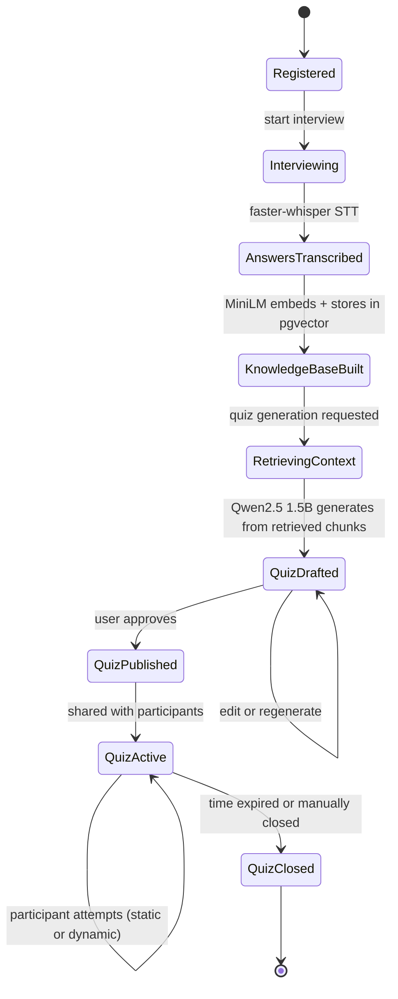

# State Diagram

```mermaid
stateDiagram-v2
  [*] --> Registered
  Registered --> Interviewing: start interview
  Interviewing --> AnswersTranscribed: faster-whisper STT
  AnswersTranscribed --> KnowledgeBaseBuilt: MiniLM embeds + stores in pgvector
  KnowledgeBaseBuilt --> RetrievingContext: quiz generation requested
  RetrievingContext --> QuizDrafted: Qwen2.5 1.5B generates from retrieved chunks
  QuizDrafted --> QuizDrafted: edit or regenerate
  QuizDrafted --> QuizPublished: user approves
  QuizPublished --> QuizActive: shared with participants
  QuizActive --> QuizActive: participant attempts (static or dynamic)
  QuizActive --> QuizClosed: time expired or manually closed
  QuizClosed --> [*]
```
