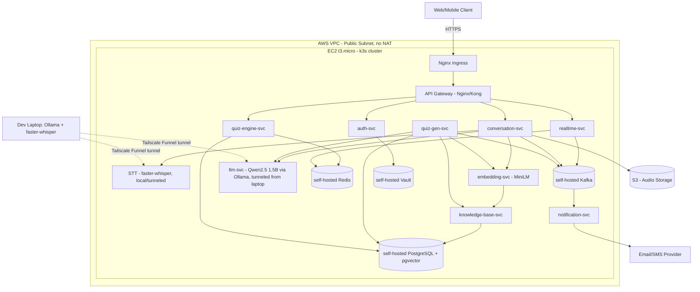

# System Architecture

```mermaid
graph TD
  Client[Web/Mobile Client] -->|HTTPS| ING[Nginx Ingress]
  subgraph VPC[AWS VPC - Public Subnet, no NAT]
    subgraph EC2Node[EC2 t3.micro - k3s cluster]
      ING --> GW[API Gateway - Nginx/Kong]
      GW --> Auth[auth-svc]
      GW --> Conv[conversation-svc]
      GW --> QEng[quiz-engine-svc]
      GW --> RT[realtime-svc]
      Conv --> STT[STT - faster-whisper, local/tunneled]
      Conv --> EmbedSvc[embedding-svc - MiniLM]
      Conv --> LLM[llm-svc - Qwen2.5 1.5B via Ollama, tunneled from laptop]
      EmbedSvc --> KB[knowledge-base-svc]
      KB --> PG[(self-hosted PostgreSQL + pgvector)]
      QGen[quiz-gen-svc] --> EmbedSvc
      QGen --> LLM
      QGen --> KB
      QGen --> PG
      QEng --> PG
      QEng --> Redis[(self-hosted Redis)]
      RT --> Redis
      RT --> Kafka[(self-hosted Kafka)]
      Conv --> Kafka
      QGen --> Kafka
      Kafka --> Notif[notification-svc]
      Auth --> Vault[(self-hosted Vault)]
    end
  end
  Notif --> EmailSMS[Email/SMS Provider]
  S3[(S3 - Audio Storage)]
  Conv --> S3
  Laptop[Dev Laptop: Ollama + faster-whisper] -.->|Tailscale Funnel tunnel| LLM
  Laptop -.->|Tailscale Funnel tunnel| STT
```
