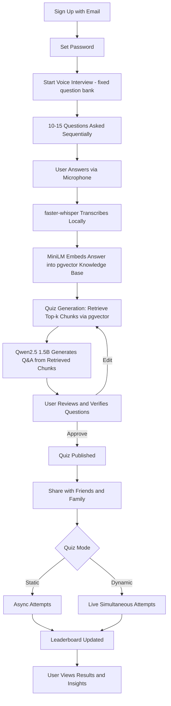

# User Flow

```mermaid
flowchart TD
  A[Sign Up with Email] --> B[Set Password]
  B --> C[Start Voice Interview - fixed question bank]
  C --> D[10-15 Questions Asked Sequentially]
  D --> E[User Answers via Microphone]
  E --> F[faster-whisper Transcribes Locally]
  F --> G[MiniLM Embeds Answer into pgvector Knowledge Base]
  G --> H[Quiz Generation: Retrieve Top-k Chunks via pgvector]
  H --> I[Qwen2.5 1.5B Generates Q&A from Retrieved Chunks]
  I --> J[User Reviews and Verifies Questions]
  J -->|Edit| H
  J -->|Approve| K[Quiz Published]
  K --> L[Share with Friends and Family]
  L --> M{Quiz Mode}
  M -->|Static| N[Async Attempts]
  M -->|Dynamic| O[Live Simultaneous Attempts]
  N --> P[Leaderboard Updated]
  O --> P
  P --> Q[User Views Results and Insights]
```
